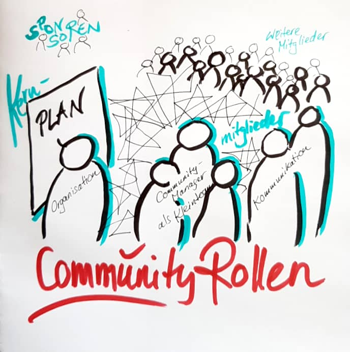
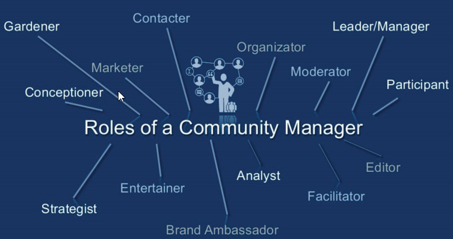

## Community-Rollen

Communities können organisch funktionieren, ohne dass bestimmte Rollen
von vornherein festgelegt werden. In der Praxis zeigt sich jedoch, dass
sich selbst bei sehr informellen Communities schnell Rollen festigen.
Schnell gibt es “Kümmerer”, “Terminplanerinnen”, „Aufräumer“,
„Event-Managerinnen“ usw. Die Idee, dass Begeisterung für eine Idee
allein ausreicht, dass Menschen sich freiwillig und ohne Ressourcen für
Themen engagieren, stimmt nur sehr begrenzt - und nur in Bezug auf
hochemotionale Themen (z.B. in Aktions-Communities). Vor allem ist damit
nicht automatisch eine abgestimmtes, ineinandergreifende Organisation
verbunden. Klare Verantwortlichkeiten für Management, Organisation von
Events, Gestaltung von Kommunikation, Anregung von Austausch sind
wichtig für die Entwicklung und das langfristige Bestehen von
Communities. Vereinbarungen und Klarheit über Rollen sind daher nur
hilfreich. Dies sollte freilich nicht dazu führen, dass Handeln in der
Community “bürokratisiert” oder “überformalisiert” wird. Rollen geben
einzelnen Mitwirkenden ein Mandat, das ihre Initiative nicht lähmt,
sondern sie beflügelt.

- **Community Manager** (im Schaubild “Moderatoren”): sind für die
  Koordination von Planung, Start, Aufbau und Transformation der
  Community zuständig. Sie sind für die Aktivierung der Community
  zuständig, d.h. sie regen Austausch, Erstellung von Inhalten, Teilen
  von Wissen, Organisation von Events an. Sie stellen technische
  Funktionalitäten sicher und behalten die Zielerreichung einer
  Community im Blick. Community Manager sollten sich nicht als “Chefs”
  der Community verstehen, sondern eher als “Gastgeber”. In der Praxis
  sind verschiedene Namen für die Community Manager Rolle gängig (z.B.
  Community Coordinator, Community Leader, Community Facilitator,
  Fachforum-Sprecherin).

- **Community Kernteam** (“Moderatorenteam”)**:** Meistens wird das
  Management einer Community von einem kleinen Team gestaltet. Je nach
  Größe und Bedeutung einer Community kann es sinnvoll sein, die
  Aufgaben einer Community Managerin zu verteilen. Bei Communities
  rund um Fachthemen, können z.B. Subject Matter Experts - also
  Fachexpertinnen oder Kuratoren, mit ins Community Management Team
  aufgenommen werden, die zu Fachthemen beraten und diese aufbereiten
  können. Bei globalen Communities sind lokale Vertreterinnen wichtig,
  um für Wissensdiversität zu sorgen sowie lokale Bedürfnisse
  berücksichtigen zu können. Und immer sinnvoll: unterschiedliche
  Menschen mit ihren unterschiedlichen Kommunikationsstilen und
  Interessen sorgen im Community-Management für Vielfalt von
  Interaktion, Meinung, Stil und erreichen damit auch oft mehr
  Menschen.

- **Community-Mitglieder:** Mitglieder sind idealerweise Mitwirkende,
  die an den Interaktionen der Community teilnehmen. Dadurch erhalten
  sie selber Nutzen und/oder stiften Nutzen für andere. Die Mitglieder
  einer Community können je nach Aktivitätsgrad kategorisiert werden
  (z.B. “Kernmitglieder” (s. Schaubild) oder aktive Mitglieder,
  periphere Mitglieder/Lurker (Zuschauer und “interessierte
  Mitarbeitende” (s. Schaubild). Dergleichen Differenzierungen helfen
  Community Managerinnen, die Mitglieder zielgerichtet einzubeziehen.
  Community Managerinnen sollten nicht erwarten, dass 100% der
  Mitglieder einer Community aktive Mitglieder sind (s.a. 90:9:1-Regel
  bzw. 1% Regel).

- **Community Sponsoren:** Sie sind einflussreiche Person bzw.
  Führungskräfte in der Organisation, die hinter dem Thema und den
  Zielen der Community steht. Management Sponsoren sind für die
  Legitimation der Community und die Verfügbarkeit von Ressourcen
  wichtig.

### Anforderungen an das Community Management

So vielfältig die Zwecke und Ziele von Communities sein können, so stark
variieren auch die Anforderungen an Community Managerinnen. Was
Community Manager unbedingt mitbringen müssen, ist Engagement. Ohne
begeisterte und begeisternde Community Manager ist es kaum möglich, eine
lebendige Community zu etablieren und zu führen. Nicht nur beim Start,
sondern insbesondere davor - in der Phase der Konzeption und der
Gewinnung engagierter Team-Mitglieder oder Partner - sind hoher Einsatz
ebenso unabdingbar wie die Fähigkeit, Beziehungen aufzubauen und andere
mitzunehmen. Zum Verständnis eine kleine Analogie:

Stellt euch vor, ihr werdet zu einer Gartenparty eingeladen. Vielleicht
fragt ihr euch vorher: Soll ich überhaupt dort hingehen? Soll ich etwas
mitbringen? Wer ist noch eingeladen? Kenne ich die Leute? Verbinden uns
gemeinsame Themen? Soll ich mich bei der Party als “Grillmeister”
einbringen? Als Community Managerinnen seid ihr Gastgeberinnen. Und so
wie gute Party-Hosts für eine bestimmte Atmosphäre sorgen, sich um Gäste
kümmern, den Rahmen setzen etc., ist es die Rolle von Community
Management sich vor einem Go-Live Gedanken über die Fragen möglicher
Teilnehmerinnen zu machen und entsprechende Rahmenbedingungen zu
schaffen. Auch während der Party seid ihr als Gastgeberinnen gefragt,
z.B. die Gäste untereinander in Kontakt zu bringen und ihnen
Möglichkeiten zu bieten, sich mit konkreten Dingen einzubringen (Musik
machen, grillen, etc.). Als Community Managerinnen sorgt ihr dafür, dass
die Party in Schwung kommt, Mitglieder sich wohlfühlen, Unbekannte in
Kontakt miteinander treten etc.

Wir haben weiter vorn erwähnt, dass das Management einer Community in
den meisten Fällen von einem Team geleistet wird. Das ist gut so, denn
die Anforderungen an Community Managerinnen sind vielfältig! Eine
Infografik aus einem [Blog-Beitrag von BUW Digital](https://www.tixxt.com/de/infografik-der-buw-corporate-community-management/)
beschreibt in 10 Erfolgsfaktoren für erfolgreiches Community Management:
Empathie, Serviceorientierte Denkart, Reaktionsgeschwindigkeit, Ängste
nehmen, begeistern, vorleben, entertainen, Veranschaulichen und das
Niveau treffen, Adaption von Prozessen, Kontinuität, Stringenz,
Konsequenz und Kohärenz, charmantes Nerven. Dazu kommen noch
Zuverlässigkeit, Initiative, im Thema zu Hause zu sein, Teamplayerin und
freundlich im Kontakt zu sein. Als grobe Umschreibung passt das gut - je
nach Zweck, Ziel und Kontext der Community können Anforderungen und
Erfolgsfaktoren aber auch stark variieren. Das spiegeln die
[Stellenprofile](https://www.bvcm.org/2016/08/corporate-community-manager-stellenprofil-fuer-arbeitnehmer-und-arbeitgeber/#download) eines Community Managers des Bundesverbands für
Community Management e.V. (BVCM) wider, die nach persönlichen,
fachlichen, sozialen, Führungs- und Methodenkompetenzen unterscheiden.

Meistens ist es zu viel verlangt, dass eine Person gut vernetzen kann,
fachlich tief im Thema steckt, freundlich aber konsequent ist,
detailgenau und voller Ideen für innovative Austauschformate. Deshalb
ist es gerade bei größeren und komplexeren Communities sinnvoll,
Einzelanforderungen in Rollen zu bündeln. Die Robert Bosch GmbH hat die
vielfältigen Rollen eines Community Managers herausgearbeitet und dabei
ganz unterschiedliche Profile erstellt - vom Strategen zur Gärtnerin,
Content-Managerin, Moderator zur Unterhalterin (siehe Schaubild). In
vielen Fachcommunities, wie z.B. bei der Gesellschaft für Internationale
Zusammenarbeit, werden Communities von Teams aus Kuratorinnen für
fachliche Expertise, Koordinatoren für die Vernetzung und Moderation und
technischen Unterstützerinnen zusammengesetzt. Bei der deutschen Telekom
unterscheidet man zwischen Inhaltserstellern, Moderatorinnen,
“Lebenszirkel-Begleitern”, Administratorinnen, Evaluatoren und
themenspezifischen Fachexpertinnen.

*Verschiedene Rollen eines Community Managers bei der Robert Bosch GmbH
(Quelle: Stellenprofil Corporate Community Manager, BVCM e.V., 2016, S.
27).*

So breit aufzuschlüsseln muss man die Rolle des Community-Managers in
den meisten Fällen nicht. Wenn man bestimmte Rollen-Tätigkeiten von
Community Management in den Mittelpunkt stellen möchte, dann sind dies
Netzwerken, Moderation, Vermitteln und Begeistern.

### Community Manager - Eine Rolle im Wandel, eine Rolle für den Wandel

Die Rolle einer Community Managerin ist komplex, sie ist aber auch breit
auslegbar und kann gut nach persönlichen Neigungen und Stärken
ausgestaltet werden. Jeder kann in die Rolle eines Community Managers
hineinwachsen - die meisten steigen quer in das Feld ein. Wer ohnehin
schon Fachexpertise hat, erreicht über die gemeinsame Wellenlänge leicht
andere Interessierte. Wer sich für Veränderungen von unten im
Unternehmen einsetzt, der weiß vermutlich, wo er Gleichgesinnte in
seinem Netzwerk findet, die aktiviert werden können. Für Fachexpertinnen
erfordert erfolgreiches Community Management oft ein Umdenken - denn das
Mitnehmen anderer ist in der Community mindestens genauso relevant wie
das Teilen und Einbringen von Fachwissen. Kommunikatorinnen wiederum
werden beruflich häufig mit One-To-Many-Kommunikationsformen groß, und
müssen Fähigkeiten, wie das Zuhören und den direkten Dialog in der
Moderation von Communities neu erlernen. Wer Community Manager werden
und damit auf bestehende Tätigkeiten aufsatteln möchte, muss bereit
sein, einen Rollenwandel zu durchlaufen.

Community Management nutzt ein Set von strategischen und operativen
Fertigkeiten, mit denen man auch bestehende Tätigkeitsprofile auf eine
neue Ebene heben kann. Etwa weil man vielleicht zum ersten Mal viele
Menschen daran teilnehmen lässt, sie einbezieht oder mit Mitteln des
Community Managements koordiniert und führt. So sehen wir in der Praxis
Community Manager mit vielfältigen Karrieren und Hintergründen: Frühere
Redakteure, Wissensmanager, Trainerinnen, Kommunikatoren, Projektleiter,
Teamleiterinnen, Innovationsmanager, IT-Spezialistinnen, Berater, und so
weiter und so fort.

Euer Wirken als Community Manager hängt also mehr oder weniger von euren
selbst gesteckten Zielen und eurer Motivation ab. Wollt ihr einfach mal
10 Kollegen in eine Gruppe holen und einen gemeinsamen Wissensaustausch
koordinieren? Oder wird daraus mehr: Weitere Kolleginnen kommen hinzu,
es geht plötzlich um gemeinsam erarbeitete Dokumente, die Organisation
von Treffen oder Schulungen, die gegenseitige Hilfe bei Problemlösungen,
und schließlich vielleicht sogar eine Open-Source-Bewegung, die zusammen
ein riesiges Projekt stemmt? Je nachdem, was ihr erreichen wollt, oder
welche Ziele nach eurem Aufbruch ins Neuland hinzukommen, könnt ihr auch
eure Erfahrungen und euer Wissen Zug um Zug ausbauen. Es ist nicht
nötig, alles von Anfang an zu wissen. Wichtiger ist ein offenes Gespür
für die Bedürfnisse eurer Community und der Wille, damit konstruktiv
umzugehen und damit zu wachsen. Viele hilfreiche Methodiken dafür und
viele Tipps, wie ihr euer Wissen ausbauen könnt, findet ihr in diesem
Guide.

Unsere Empfehlung an dieser Stelle wäre: Seid ehrlich mit euch selbst,
folgt eurer inneren Stimme, seid bereit zu lernen, auch über euch
selbst. Seid aber auch großzügig mit euch, wenn ihr meint, dass ihr
irgendwelche Skills (noch) nicht weit genug entwickelt habt. Bei dem
Rollenwandel, den ihr angeht, ist der Weg das Ziel. Am Ende wird die
wesentliche Fähigkeit von euch als Community Managerinnen immer noch
sein: Andere Menschen einzubeziehen. Das bedeutet auch zu erkennen, wo
eure Stärken liegen und welche zusätzlichen Fähigkeiten, welches Wissen
und welche Kompetenzen ihr euch über Mitstreiterinnen ins Community
Management Team hinein holt.