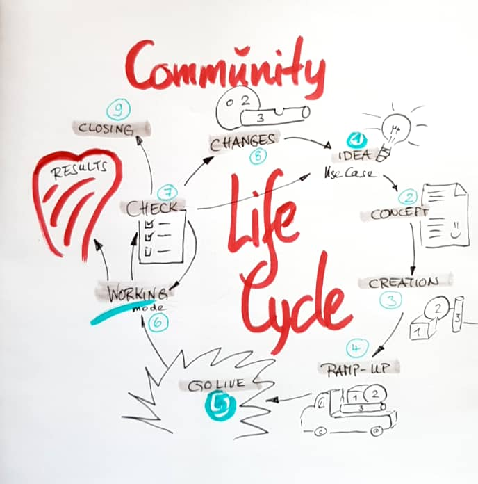

## Community Lifecycle

Planung, Start, Aktivierung, Führung und Transformation von Communities
lassen sich nicht als linearer Prozess mit klar definiertem Anfang und
Ende darstellen. Hilfreicher ist es, ähnlich wie bei der Entwicklung von
Teams oder Produkten, bestimmte Phasen zu benennen, die man in
Iterationen durchlaufen kann.

*Visualisierung inspiriert durch "Der Community Lifecycle der Robert Bosch GmbH, 2016"*

Kreise haben keinen Anfangs- und keinen Endpunkt. Auch die Arbeit in und
mit einer Community endet erst dann, wenn sie gemeinsam mit allen
Mitgliedern offiziell beendet wurde.

### Projekt- oder Produktmanagement?

Wir sind immer wieder Sponsoren von Communities begegnet, die der
Auffassung waren: Wenn die Plattform erst mal steht, läuft die Community
von selbst. Projekt abgeschlossen.

Erfahrene Community Managerinnen wissen natürlich: So ist das nicht. Auf
ihren Erfahrungen beruht das Lebenszyklus-Modell. Wer dieses ernst
nimmt, muss entschieden sagen: Der Aufbau einer Community ist kein
“Projekt” im Sinne von “in time, in budget & in quality”. Es
funktioniert nicht, eine Community vorab von Anfang bis Ende im Detail
durchzuplanen, ihr eine dazu passende, starre Menge an Ressourcen
zuzuweisen, um so zu einem natürlich genau geplanten
Fertigstellungstermin die vorab definierten Qualitäts- und
Abnahmekriterien zu erreichen. Und sich zur Krönung auf die Schulter zu
klopfen und die Arbeit an der Community zu beenden.

Nein, bei der Weiterentwicklung einer Community denkt man besser nicht
in unbeweglichen Meilensteinen und granularen Plänen. Dauerhaft effektiv
ist es hingegen, die Community in Schleifen weiterzuentwickeln, mit
Prototypen und Experimenten zu arbeiten, ständig das Feedback der
Mitglieder aufzunehmen und dieses in die Aktivitäten einfließen zu
lassen.

Es würde wohl auf eine falsche Fährte führen, eine Community rein als “Produkt” zu sehen, denn dazu sind die Menschen und die Beziehungsarbeit zu wichtig. Dennoch liegt die angewandte Methodik, mit der ihr eine Community aufzieht und organisiert, näher am Produktmanagement als am klassischen Projektmanagement. Kundenzentrierung (Mitglieder) und ein agiles Vorgehen sind das, was Communities voranbringt. Und zwar nicht bis zu einem früh voraus geplanten Ziel- und Endtermin, sondern bis das letzte Mitglied sie verlässt.